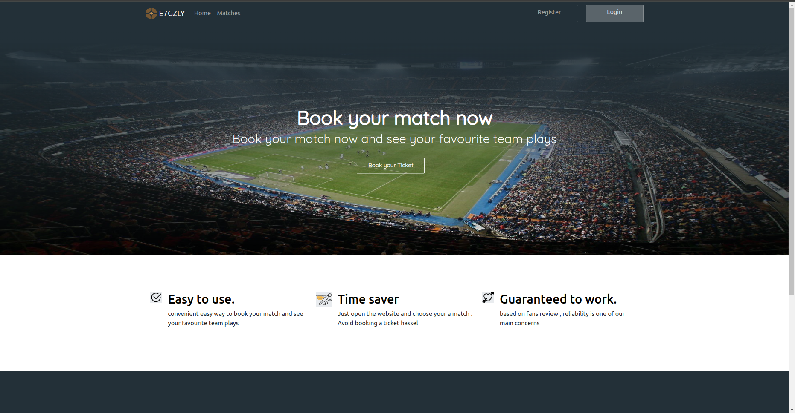
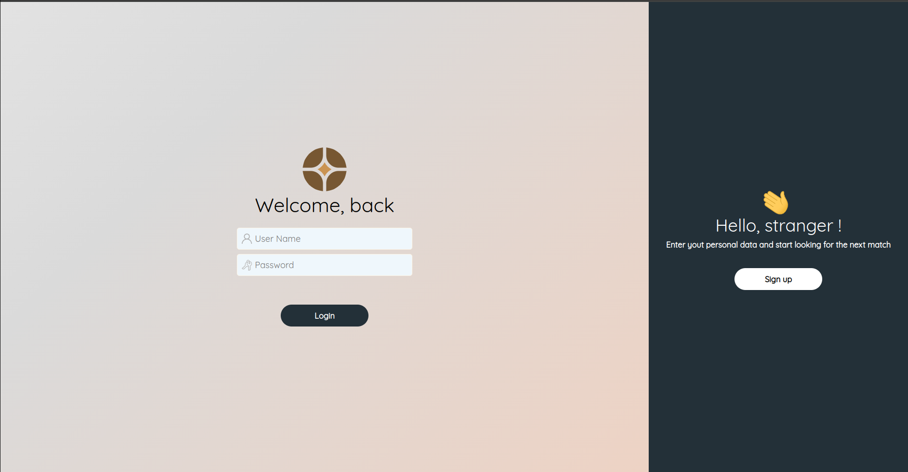
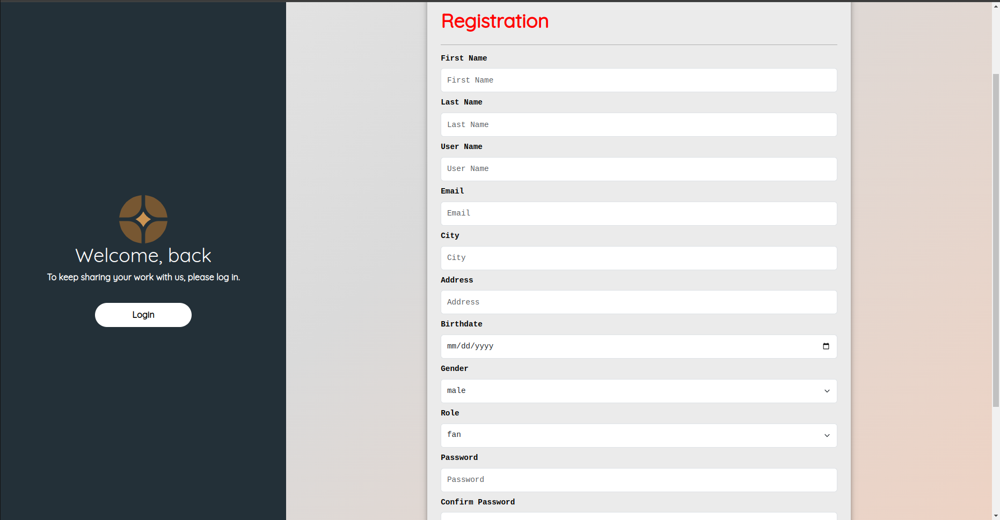
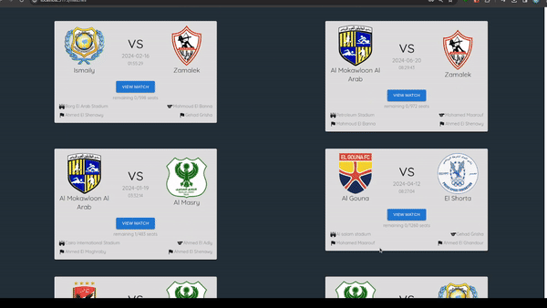
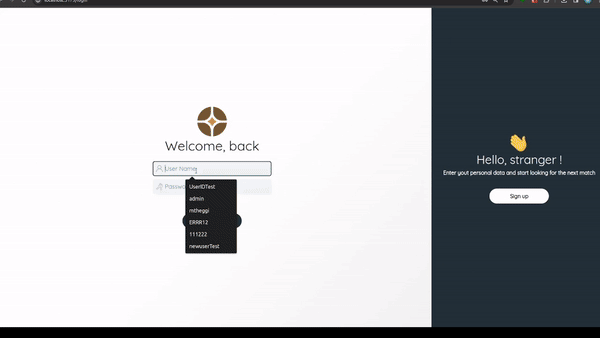

# ⚽ E7GZLY - match Reservation System ⚽

## Table of Contents
- [Introduction ](#Introduction)
- [Usage](#Usage)
- [Main-Pages](#Main-Pages)
- [Reference](#Reference)

## Introduction
An online automated ticket reservation system for football matches in the Egyptian Premier League is requested by the client. The system allows the EFA (Egyptian Federation Association) management to create, manage, and maintain current and future matches. The system should allow the users to reserve specific seats for the matches they want to attend.
The system is used by the EFA management to keep track of matches schedules, number of attendees, match officials and the registered users.
## Usage
- Clone the repo
- run `npm install` to install all dependencies
- change the connection string of the database in your `env` file
- run `npm start` to start the server
## Main-Pages
### Landing Page

### Login Page

### Register Page

### matches Page

### Tickets Reservation 
 
### admin Page

## Reference
[Project description in more details](https://drive.google.com/file/d/1SpV80gQPn8pc51vOo9fX-aZW6O4yWuGj/view)
## contributors
- mohamed Tarek 
- Osama Nasser
- salah abotaleb 
- moaz tarek 